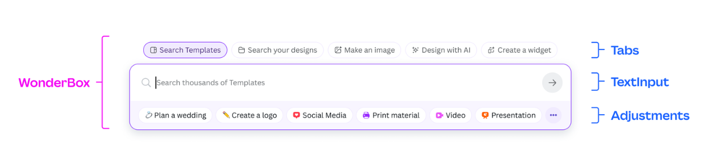

# Wonder Box

An adaptive, yet familiar interface

No matter where you use Wonder Box, the interface remains the same. This creates a familiar experience for users across surfaces and doesn't require them to relearn what to do.



## Definitions

### Tabs

The top-level navigation for Wonder Box. Clicking on the tab impacts what Wonder Box will show within itself and the content on the page.

_Also known as Grand Pills_

### TextInput

The input field where users can input text, voice or an image. This acts as a query to search or a prompt to generate something.

_Also known as Search Input, Prompt Box_

### Adjustments

Adjustments allow users to refine and get closer to what they need. These are filters to refine the content shown or prompt enhancers to arrow in on the intended result.

### Suggestions

Suggestions are dynamic to what a user has typed in the TextInput. In a search context, these can be personalised recommendations, recent searches, and autocompletes.

In the future, this could also mean autocomplete or recommendations for prompts.

_Also known as Search Flyout_

## Getting Started

After cloning install all dependencies:

```bash
npm i
```

## Development Tasks

### Start development server

Starts a Vite development server at [localhost:5173](http://localhost:5173) with hot module replacement (HMR).

```bash
npm run dev
```

### Build for production

Builds the application for production deployment:

```bash
npm run build
```

### Preview production build

To preview the production build locally:

```bash
npm run preview
```
